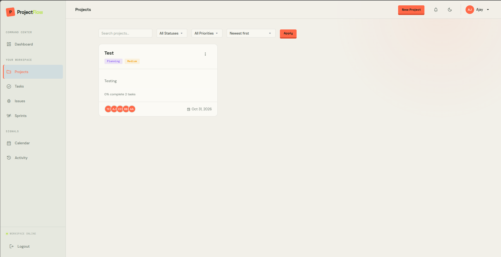
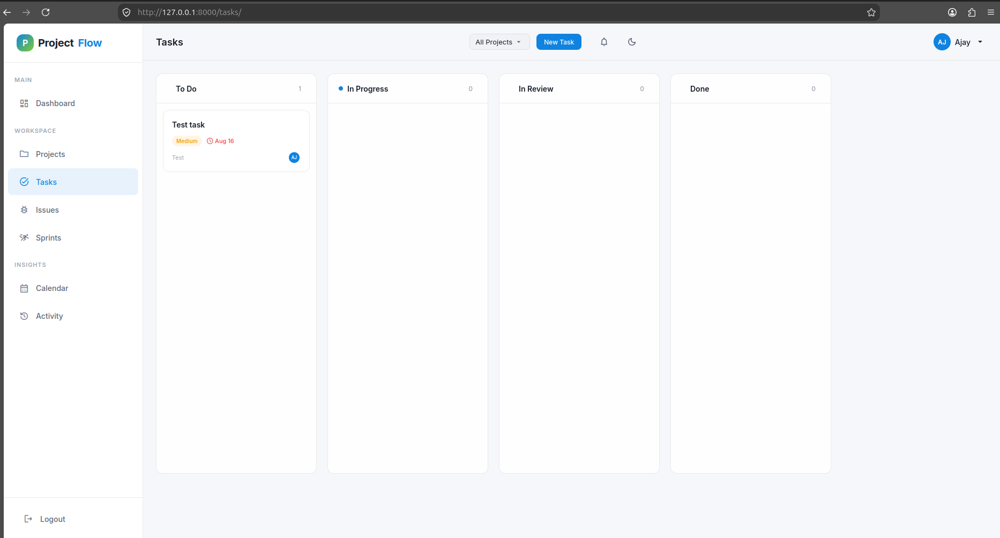
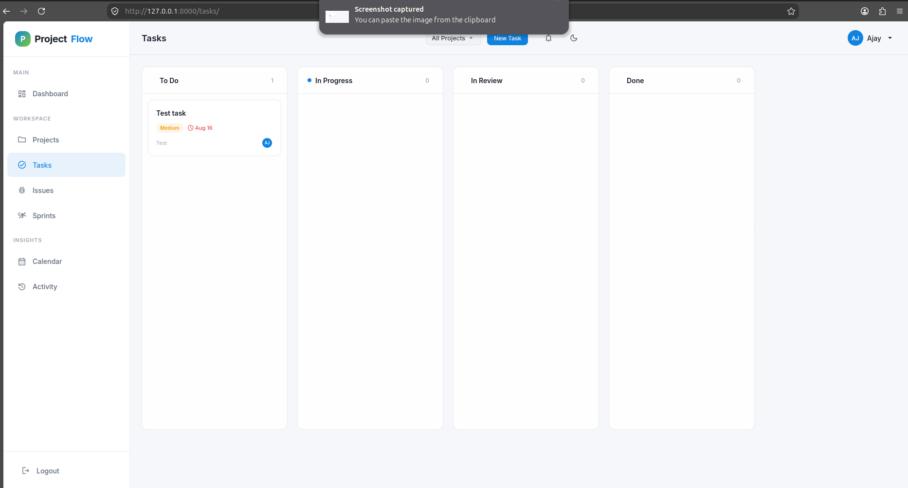
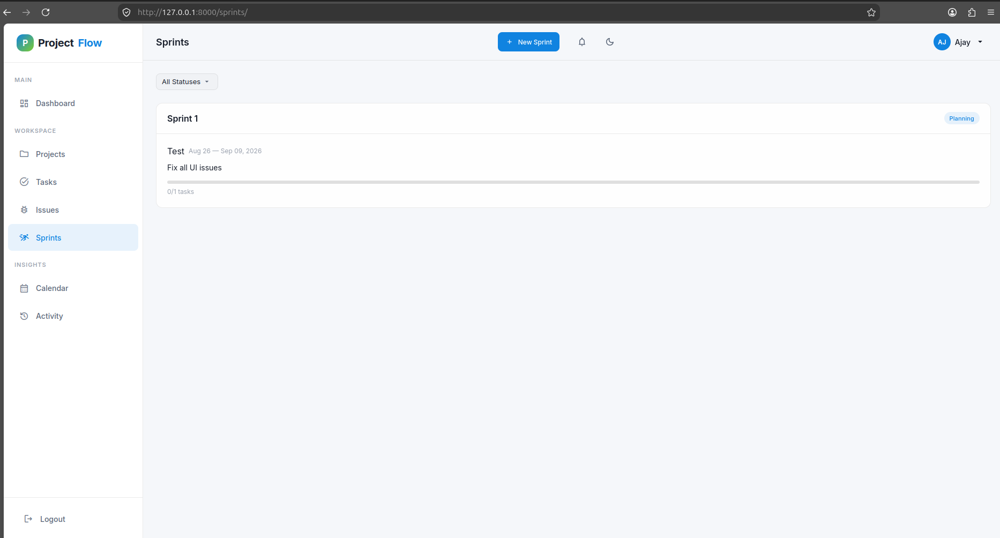
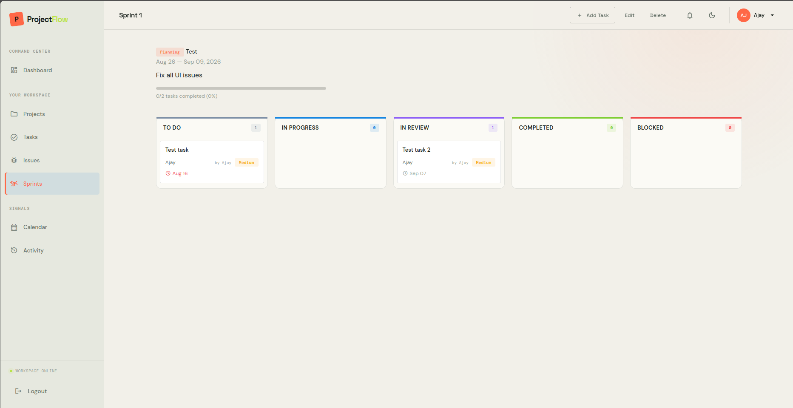
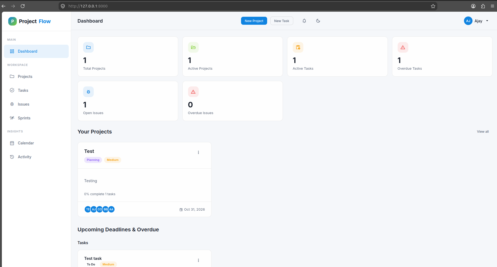
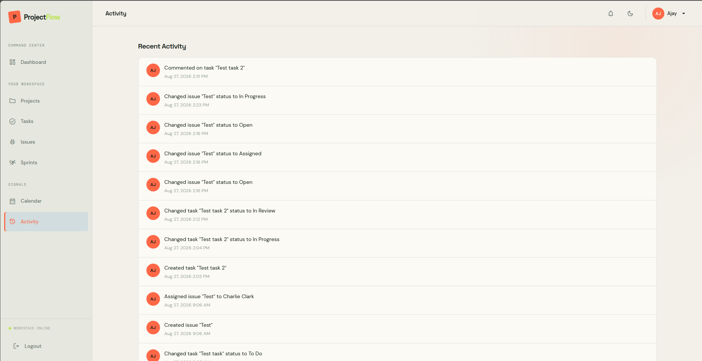

# 🚀 ProjectFlow

> ✨ Team project management in Django: projects with roles, Kanban tasks and issues, sprints, calendar, activity feed, and notifications — with dark / light / system theming.

## 🌟 Features

- 📁 **Projects** — CRUD, status and priority tracking, team membership with roles (admin, manager, member, viewer), bookmarks
- ✅ **Tasks** — Kanban with drag-and-drop, priorities, tags, assignees, comments, filters
- 🐞 **Issues** — Kanban bug tracking with severity, reproduction steps, resolution, comments
- 🏃 **Sprints** — planning, active-sprint tracking, task assignment
- 📅 **Calendar** — month view of tasks, issues, and milestones, plus upcoming agenda
- 🔔 **Activity & notifications** — per-object activity log, unread badge with polling
- 🎨 **Theming** — dark, light, and system modes, persisted per user and in `localStorage`
- 🔐 **Auth** — custom email-login user model, profile with avatar and bio, password reset via console email backend
- 🛠️ **Admin** — customized Django admin

## 🧰 Tech stack

| Layer    | Choice                                                        |
| -------- | ------------------------------------------------------------- |
| ⚙️ Backend  | Django 6.1, Python 3.10+                                      |
| 🗄️ Database | SQLite (dev)                                                  |
| 🖥️ Frontend | Vanilla JS, server-rendered Django templates, custom CSS      |
| 🔤 Fonts / icons | DM Sans, Space Grotesk, DM Mono; Material Icons / Symbols |

## ⚡ Quickstart

```bash
git clone <repository-url>
cd ProjectManagement

python -m venv venv
source venv/bin/activate        # Linux/macOS
venv\Scripts\activate           # Windows

pip install django
python manage.py migrate
python manage.py createsuperuser
python manage.py runserver
```

🌐 Open <http://127.0.0.1:8000/>.

### 🌱 Demo data (optional)

```bash
python manage.py shell < seed_data.py
```

Seeds 3 users, 4 projects, 9 tasks, tags, and comments. Log in with:

| User    | Email               | Password |
| ------- | ------------------- | -------- |
| 👩 alice   | alice@example.com   | demo123  |
| 👨 bob     | bob@example.com     | demo123  |
| 🧑 charlie | charlie@example.com | demo123  |

## 📂 Project structure

```
config/          # ⚙️ settings, root URLs, WSGI
core/            # 🏠 dashboard, shared forms, context processors
accounts/        # 👤 custom user model, auth, profile, theme endpoint
projects/        # 📁 projects, memberships, roles, bookmarks
tasks/           # ✅ tasks, tags, comments, Kanban
issues/          # 🐞 issues, comments, Kanban
sprints/         # 🏃 sprints and sprint tasks
calendar_view/   # 📅 month calendar and agenda
activity/        # 📜 activity log and feed
notifications/   # 🔔 notifications and unread count API
templates/       # 🧩 global + app templates (base.html owns the toast markup)
static/css/main.css  # 🎨 design system, themes, toast styles
static/js/main.js    # 🧠 theme toggle, dropdowns, modals, toast auto-dismiss
seed_data.py     # 🌱 demo dataset
```

## ⚙️ Configuration notes

- 🔑 Login uses **email** (`USERNAME_FIELD = 'email'`); `username` is still required.
- 🎨 Theme preference lives on the user (`dark` / `light` / `system`); the toggle posts to `/accounts/theme/` and mirrors to `localStorage` key `pf-theme`.
- 💬 Toasts render from Django `messages` in `templates/base.html` (`.messages-container` / `.message-*` in `static/css/main.css`, auto-dismiss in `static/js/main.js`).
- 📸 Media uploads go to `media/` (`MEDIA_URL = 'media/'`); static source is `static/`, collected to `staticfiles/`.
- 📧 Email uses the console backend in development.
- ⚠️ `DEBUG = True` with a dev `SECRET_KEY` — replace both before any deployment.

## 🧪 Tests

```bash
python manage.py test
```

Covers accounts, projects (including roles), tasks, and activity.

## 📸 Screenshots

| 🏠 Dashboard | 📁 Projects |
| --------- | -------- |
|  |  |

| ✅ Tasks Kanban | 🐞 Issues Kanban |
| ------------ | ------------- |
|  |  |

| 🏃 Sprints | 🏃 Sprint detail |
| ------- | ------------- |
|  |  |

| 📅 Calendar | 📜 Activity |
| -------- | -------- |
|  |  |

## 📄 License

Released under the [MIT License](LICENSE) — free to use, modify, and distribute.
